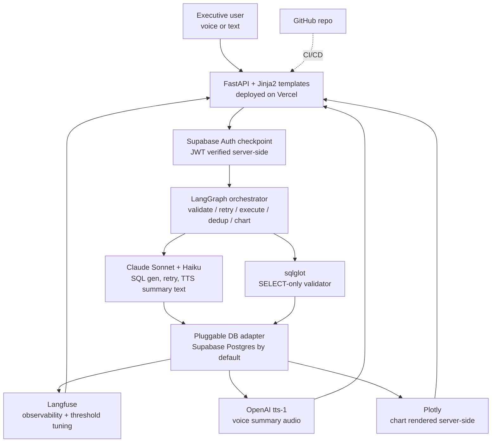
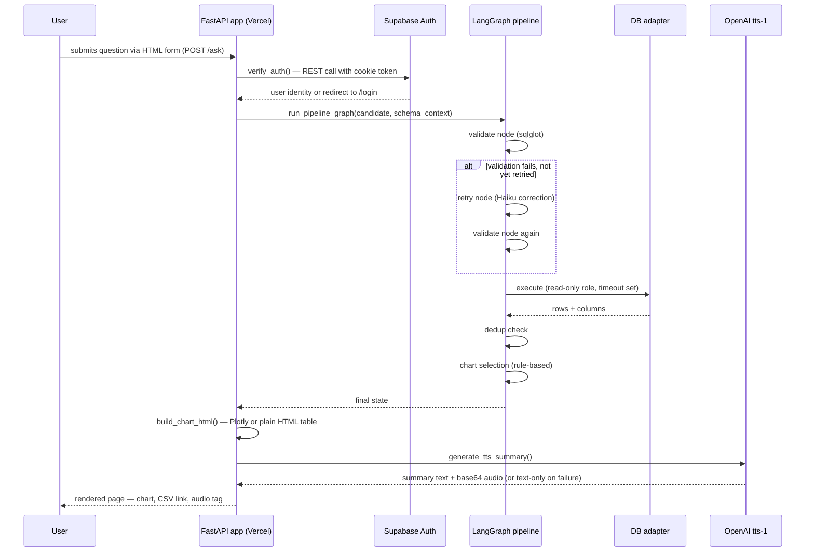
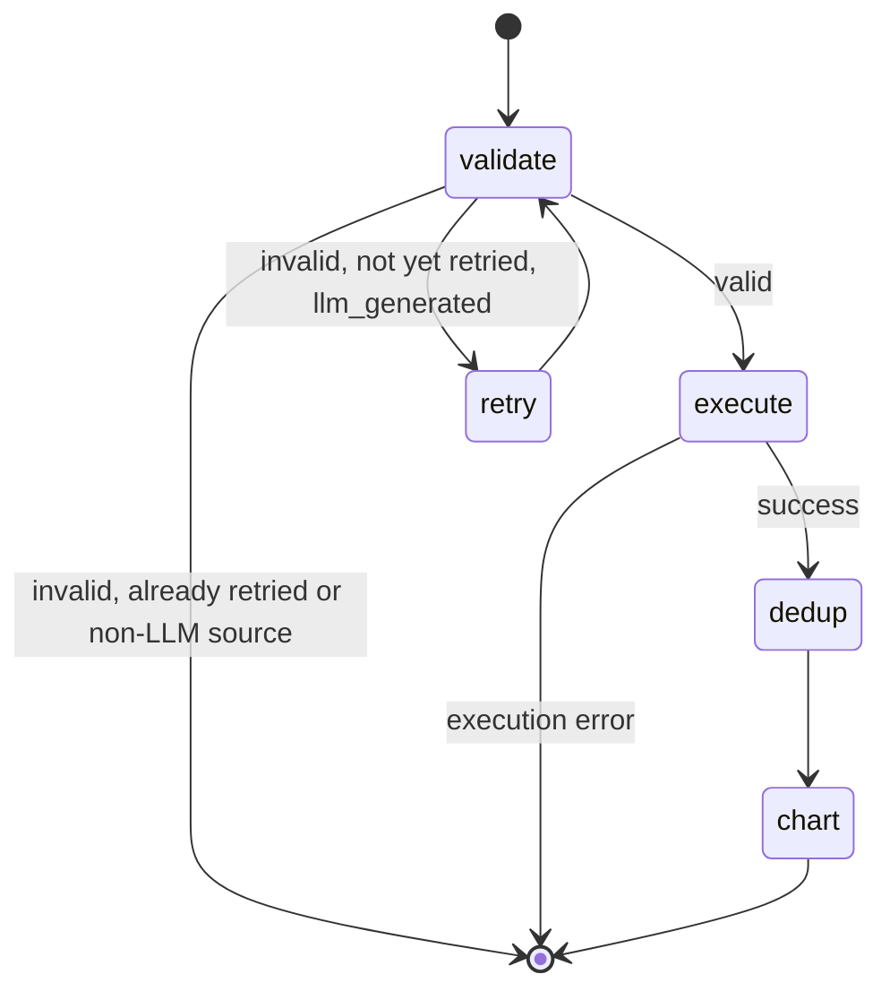
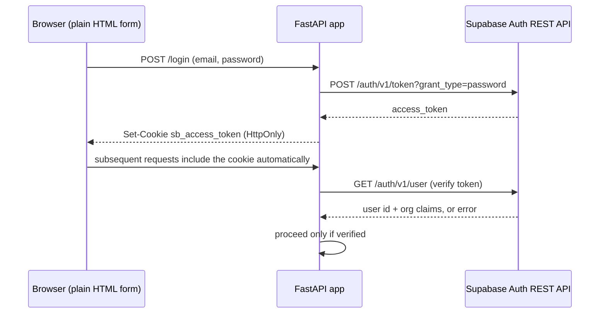

# Voxquery (Python) — Architecture, Workflow & Implementation Guide

Covers 4.5 (SQL Generator, Validator, Executor), 4.6 (Chart Selector &
Output), 4.7 (TTS Voice Summary) — fully rebuilt in Python.

Mermaid diagrams below render natively on GitHub.

---

## 1. Architecture — tools used



| Layer | Tool | Why this one |
|---|---|---|
| Web framework | **FastAPI** | Async-friendly, plays well with Vercel's Python runtime, minimal boilerplate |
| Frontend | **Jinja2 templates, server-rendered HTML** | Zero custom JavaScript — matches a Python-only comfort zone |
| Charting | **Plotly (Python)** | Generates its own JS internally via `fig.to_html()` — you write only Python, never touch the generated script |
| Hosting | **Vercel** (Python runtime) | Same platform as before; `vercel.json` + `@vercel/python` builder run the FastAPI app as a serverless function |
| Auth | **Supabase Auth**, called via plain REST (`httpx`) | No browser SDK needed for email/password sign-in |
| Database | **Supabase Postgres** (config-swappable) | Same as before — direct `psycopg2` connection, bypassing PostgREST for raw SQL |
| SQL validation | **sqlglot** | The tool the original spec named — Python-native, no longer a JS substitute |
| Orchestration | **LangGraph** (Python package) | Native library, not a port — same graph structure as before |
| SQL generation / retry / TTS text | **Claude Sonnet + Haiku** | Unchanged — model choice doesn't depend on the host language |
| Voice output | **OpenAI tts-1 (alloy)** | Unchanged |
| Observability | **Langfuse** | Unchanged |
| Source control / CI | **GitHub + GitHub Actions** | Runs `py_compile` + an import check before Vercel deploys |

---

## 2. Workflow — request lifecycle



---

## 3. LangGraph orchestration

Same rationale as the TypeScript version — the checkpoint sequence
(validate → retry-once-if-needed → execute → dedup → chart) is expressed
as a `StateGraph` with explicit conditional edges rather than nested
if-statements, using the native Python `langgraph` package.



Implementation: `lib/langgraph/pipeline_graph.py`. Offered as an
alternative to `lib/pipeline/guardrails.py` — both enforce the identical
checkpoint sequence. Toggle between them with `?engine=langgraph` on the
`/ask` web route, or call `/api/query` vs `/api/query-langgraph` directly.

---

## 4. Skills — modular capability boundaries

| Skill | File | Input | Output | Guardrail it enforces |
|---|---|---|---|---|
| SQL generation | `lib/llm/sql_generator.py` | question, schema context, history | `GeneratedSQL(sql, confidence)` | Never invents table/column names outside provided context |
| SQL validation | `lib/validation/sql_validator.py` | raw SQL, dialect, allowlist | safe SQL or rejection | SELECT-only, known tables/columns, row cap injection |
| Query source resolution | `lib/query_sources/resolver.py` | LLM / RAG / file / external input | normalized `QueryCandidate` | No source bypasses downstream validation |
| DB execution | `lib/db/providers/*.py` | validated SQL | rows + columns | Read-only transaction, statement timeout, scoped role |
| Dedup detection | `lib/pipeline/dedup_check.py` | execution result | warning or none | Flags cross-join inflation instead of silently returning it |
| Chart selection | `lib/chart/selector.py` | execution result | chart type + rationale | Deterministic — no LLM cost, no hallucinated chart choice |
| Chart rendering | `lib/chart/render.py` | chart selection + result | HTML (Plotly or table) | Keeps chart logic separate from selection logic |
| TTS summary | `lib/tts/summary.py` | question, result sample | text + optional audio | Fails silently to text-only, never surfaces a TTS error |
| Auth | `lib/pipeline/auth.py` | request header/cookie | user identity or rejection | Never uses the Supabase service_role key |
| Rate limiting | `lib/pipeline/rate_limiter.py` | user id | allow/deny | Caps combined query + TTS calls per minute |

---

## 5. Guardrails checklist

- [ ] No DDL/DML ever reaches the database — enforced at the sqlglot AST
      layer and the database role's grants.
- [ ] The Supabase **service_role** key never appears in this project's env vars.
- [ ] Row cap and statement timeout enforced at both the query-string level
      (validator injects `LIMIT`) and the connection level
      (`SET statement_timeout`, `SET TRANSACTION READ ONLY`).
- [ ] Exactly one retry on validation failure, capped in code.
- [ ] Every generated SQL statement, validation outcome, and execution time
      logged to Langfuse (wire this in — not yet connected in the MVP).
- [ ] Every query candidate — regardless of source — passes through the
      same validator.
- [ ] Rate limiting active on both `/ask` and the JSON API routes.

---

## 6. Authentication & access control



Read-only database role (run once, in Supabase's SQL editor):

```sql
CREATE ROLE voxquery_reader LOGIN PASSWORD '<generate a strong password>';
GRANT SELECT ON
  customers, orders, order_items, order_payments,
  order_reviews, products, sellers, geolocation
TO voxquery_reader;
-- Do NOT grant anything on auth.*, storage.*, or any table holding secrets.
```

For per-org or per-role row visibility, add real Row-Level Security
policies keyed off `auth.jwt() -> 'app_metadata' ->> 'org_id'` rather than
relying on the LLM to filter correctly.

---

## 7. Step-by-step implementation

### 7.1 Prerequisites

GitHub, Vercel, Supabase, Anthropic Console, OpenAI Platform, Langfuse —
same accounts as before. Local tools: Python 3.11+, pip, git.

### 7.2 Local project setup

```bash
cd voxquery-python
python -m venv venv
source venv/bin/activate
pip install -r requirements.txt
cp .env.example .env
# fill in .env with real values — never commit this file
```

### 7.3 Supabase configuration

1. Run the `CREATE ROLE voxquery_reader ...` block from Section 6 in the
   Supabase SQL editor.
2. Copy the **Supavisor, transaction mode** connection string from
   **Project Settings → Database → Connection pooling**, swap in the
   `voxquery_reader` credentials — this is `SUPABASE_DB_URL_READONLY`.
3. Copy the **Project URL** and **anon public key** from
   **Project Settings → API** — `SUPABASE_URL` and `SUPABASE_ANON_KEY`.
   Never put the `service_role` key in this project's env vars.
4. Create at least one Supabase Auth user (email/password) to sign in
   with, via the Supabase dashboard's Authentication tab.

### 7.4 Run locally

```bash
export $(cat .env | xargs)   # or use a tool like direnv / python-dotenv
uvicorn app.main:app --reload
# visit http://localhost:8000/login, sign in, ask a question
```

### 7.5 Push to GitHub

```bash
cd voxquery-python
git init
git add .
git commit -m "Voxquery 4.5-4.7, Python implementation"
git branch -M main
git remote add origin https://github.com/<your-org>/voxquery-python.git
git push -u origin main
```

`.gitignore` already excludes `venv/`, `.env`, `__pycache__/` — check
`git status` before your first commit to be sure no secrets are staged.

### 7.6 Connect to Vercel

**Dashboard route:**
1. vercel.com → **Add New → Project** → import the `voxquery-python` repo.
2. Vercel should detect `vercel.json` and the `@vercel/python` builder
   automatically. If asked for a framework preset, choose "Other".
3. Under **Environment Variables**, add every key from `.env`.
4. Click **Deploy**.

**CLI alternative:**
```bash
npm i -g vercel   # Vercel's CLI itself is Node-based, even for Python projects
vercel login
vercel link
vercel env add SUPABASE_DB_URL_READONLY production
# repeat for each env var
vercel --prod
```

### 7.7 CI gate

`.github/workflows/ci.yml` runs `py_compile` on every `.py` file and does
an import check (`from app.main import app`) on every push/PR, using
placeholder env vars — catches syntax errors and missing imports before
Vercel ever attempts a deploy.

### 7.8 Testing each checkpoint

```bash
# 1. Auth checkpoint — visiting / without a session redirects to /login
curl -i http://localhost:8000/

# 2. Predetermined query path — no LLM call needed
curl -i "http://localhost:8000/ask-predetermined?predetermined_id=top_sellers_this_quarter" \
  -H "Cookie: sb_access_token=<a real token from /login>"

# 3. JSON API — validation guardrail should reject DDL
curl -X POST http://localhost:8000/api/query \
  -H "Authorization: Bearer <valid JWT>" \
  -H "Content-Type: application/json" \
  -d '{"generatedSql": "DROP TABLE customers", "confidence": 0.9}'

# 4. Rate limit — send 21+ requests in a minute from the same user, expect a 429
```

### 7.9 Observability

Add Langfuse logging calls at each checkpoint in
`lib/pipeline/guardrails.py` (or wrap the LangGraph nodes) — log input
SQL, validation outcome, execution time, and chart/TTS decisions. This is
what makes the 0.65 clarification threshold from 4.2 tunable post-launch.

### 7.10 Go-live checklist

- [ ] `voxquery_reader` role created, granted SELECT only on intended tables
- [ ] RLS policies in place if multi-tenant
- [ ] All env vars set in Vercel (Production scope)
- [ ] GitHub Actions CI passing on `main`
- [ ] In-memory rate limiter and result store replaced with Redis/DB-backed
      storage before real traffic (neither survives multiple server instances)
- [ ] Langfuse receiving events from a full request cycle
- [ ] TTS failure path manually tested (temporarily break `OPENAI_API_KEY`,
      confirm the page still shows a text summary with no error)

---

## 8. Cost recap

| Component | Choice | Marginal cost |
|---|---|---|
| Hosting | Vercel (Python runtime) | Free tier covers MVP traffic |
| Database | Supabase Postgres (existing) | No new infra |
| SQL generation | Claude Sonnet | Per-token, existing spec choice |
| Retry + summary | Claude Haiku | Cheaper than Sonnet, sufficient for narrow tasks |
| Validation | sqlglot | Free, open source |
| Orchestration | LangGraph | Free, open source |
| Charting | Plotly | Free, open source |
| TTS | OpenAI tts-1 | ~$15 / million characters |
| Observability | Langfuse | Existing spec choice |
